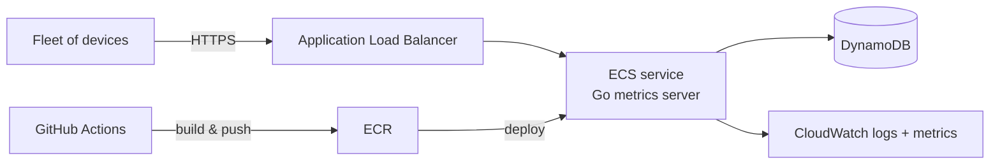

# Fleet Management Simple Metrics Server

A small Go HTTP service for ingesting per-device metrics (heartbeats,
upload stats, firmware versions, etc.) and serving aggregated stats on
demand. Metrics are defined via a registry pattern so adding a new
metric is a one-file change — see [Architecture](#architecture).

## Getting started

These steps assume you've never touched this project (or Go) before.

### 1. Install Go

This project targets **Go 1.26+** (declared in [go.mod](go.mod)). On macOS:

```sh
brew install go
```

Verify the install:

```sh
go version
# go version go1.26.x ...
```

### 2. Install dependencies

From the repository root:

```sh
go mod download
```

This pulls every module listed in `go.mod` (Gin, validators, etc.) into
your local module cache. You only need to run this once per checkout.

### 3. Run the server

```sh
go run main.go
```

The server listens on `127.0.0.1:6733` with all routes mounted under
`/api/v2`. Devices are bootstrapped from [devices.csv](devices.csv) at
startup. Press `Ctrl-C` to stop.

Quick smoke test (in another terminal):

```sh
# POST a heartbeat
curl -i -X POST http://127.0.0.1:6733/api/v2/devices/60-6b-44-84-dc-64/metrics/heartbeat \
  -H 'Content-Type: application/json' \
  -d '{"sent_at":"2026-05-04T10:00:00Z"}'
# → 204 No Content

# GET aggregated stats for that device (composite — all metrics)
curl -i http://127.0.0.1:6733/api/v2/devices/60-6b-44-84-dc-64/stats
# → 200 {"avg_upload_time":"0s","firmware":null,"uptime":100}

# GET a single metric via query parameter
curl -i 'http://127.0.0.1:6733/api/v2/devices/60-6b-44-84-dc-64/stats?metric=heartbeat'
# → 200 {"uptime":100}
```

## Architecture

```
main.go           # entry point: Gin engine, CSV bootstrap, route wiring
handlers/         # HTTP layer
  device_handler.go
adapters/         # storage layer (in-memory DB)
  db.go
metrics/          # metric registry + per-metric definitions
  registry.go     # MetricDef, Register, Lookup, All
  heartbeat.go    # registers "heartbeat"   → JSON key "uptime"
  upload_time.go  # registers "upload_time" → JSON key "avg_upload_time"
  firmware.go     # registers "firmware"    → JSON key "firmware"
services/         # placeholder
```

Each non-test source file has a `_test.go` sibling — see
[Testing](#testing).

### How metrics are added

Each metric is a single file in `metrics/` that declares its body shape
(with validation tags), parses incoming requests, and aggregates stored
samples. Registration happens in `init()`, so a new metric becomes a
one-file change with no edits to handlers, storage, or `main.go`.

```go
// metrics/firmware.go
type firmwareBody struct {
    Version string `json:"version" binding:"required"`
}

func init() {
    Register(MetricDef{
        Name:    "firmware",
        JSONKey: "firmware",
        Bind:      /* parse + validate JSON body */,
        Aggregate: /* compute response value from []StoredSample */,
    })
}
```

Each `StoredSample` carries a server-stamped `IngestedAt` time, so
metrics that don't include their own timestamp (e.g. `firmware`) can
still be ordered.

### HTTP endpoints (`/api/v2`)

| Method | Path | Description |
|---|---|---|
| `POST` | `/devices/:device_id/metrics/:metric_name` | Submit one sample. Body shape is metric-specific. `204` on success. |
| `GET`  | `/devices/:device_id/stats[?metric=a,b,...]` | Aggregated stats. No `metric` query → all registered metrics. `?metric=x` (or `x,y`) → filtered subset. Returns `200` with a `{<json_key>: <value>}` map. |

Error responses are `{"msg": "..."}` — `404` for unknown device or
unknown metric, `400` for invalid bodies.

## Testing

```sh
go test ./...           # quick run, summary per package
go test -v ./...        # verbose: every test name
go test -cover ./...    # with coverage
```

In Go, tests live alongside the code in `_test.go` files. There's no
separate test folder — the toolchain finds them automatically.

The suite is fast (<1s) and has no external dependencies, so unit and
integration tests run together. The split below is logical, not
operational.

### Unit tests

- **[adapters/db_test.go](adapters/db_test.go)** — `AddSample`/`GetSamples`
  round-trip, `DeviceExists`, unknown-device error paths, copy-on-read
  isolation (caller mutation can't leak back into storage), and a
  200-goroutine concurrent writes/reads test that exercises the
  `sync.RWMutex`.
- **[metrics/registry_test.go](metrics/registry_test.go)** — register +
  lookup, `All()` returns entries sorted by name, and confirms all
  three `init()` registrations are present at startup.
- **[metrics/heartbeat_test.go](metrics/heartbeat_test.go)** — uptime
  aggregation: empty input, single sample (returns 100% via the
  divide-by-zero guard), gap pattern (5 unique buckets / 9-minute span
  ≈ 55.56%), wrong-type bodies are skipped.
- **[metrics/upload_time_test.go](metrics/upload_time_test.go)** —
  averaging 1s/2s/3s = 2s, empty case returns `"0s"`, wrong-type bodies
  skipped.
- **[metrics/firmware_test.go](metrics/firmware_test.go)** — empty
  case, latest-wins ordering, wrong-type case (returns the prior valid
  version).

### Integration tests

- **[handlers/device_handler_test.go](handlers/device_handler_test.go)**
  — boots a real Gin engine with the `DeviceHandler` wired against an
  in-memory `DeviceDb`, then drives the full request/response flow via
  `net/http/httptest`:
  - **POST happy paths** — heartbeat, upload_time, and firmware (the
    last specifically validates that a metric *without* a `sent_at`
    field is accepted).
  - **POST error paths** — unknown metric (404), unknown device (404),
    missing required field (400), malformed JSON (400).
  - **GET composite** — POSTs three metrics, then asserts the response
    contains all three JSON keys (`uptime`, `avg_upload_time`,
    `firmware`).
  - **GET filtered** — single (`?metric=firmware`) and multiple
    (`?metric=heartbeat,firmware`) cases.
  - **GET error paths** — unknown device, unknown metric in query.

> By Go conventions these `httptest`-based handler tests are still
> unit/package tests because they run in-process with no external
> services. A *true* integration test would hit a running `:6733`
> listener or a real database. At this project's size that distinction
> wouldn't change anything operationally, so the unit/integration split
> here is named for reviewability.

## Q&A

### How long did you spend working on the problem?

Around 2 hours.

### What did you find to be the most difficult part?

The most difficult part was working with Go itself, since I don't have
prior experience with it. That included researching syntax, package
layout, idiomatic best practices, and how core mechanisms
(goroutines/locks, maps, structs) work in Go.

### Discuss your solution's runtime complexity

The runtime complexity is O(n) per request. I chose a map for the
in-memory store so device lookups stay O(1), and I avoided nested loops
in the aggregation paths. I don't currently see meaningful algorithmic
bottlenecks; the next realistic problem is unbounded in-memory growth,
not running time.

### How would you modify your data model or code to account for more kinds of metrics?

~~Right now we have a simple data structure since I only have 2 metrics and
didn't want to complicate things. This solution works if we have a small
set of metrics and aren't foreseeing any additions. However, if the number
of metrics is large, or if we'll be updating them often (for both POST and
GET), I would want to make it more scalable. Adding a new metric currently
requires modifying 5 files, which isn't the most extensible solution.

A better approach would be to have a registry of metrics with a validation
schema per metric, unify the POST endpoint and the DB method, and use a
schemaless database so the storage layer doesn't need to know each
metric's shape. When a request comes in, we'd look up the
metric name in the registry, validate the body shape against the
registered schema, and push the document to the DB. Adding a new metric
would become a one-file change. The only real cost is maintaining the
schemas as the metric count grows — but those are the API contract, so
we'd want them documented either way.

A similar idea applies to the GET endpoint: each registered metric could
also carry an aggregation function, and the existing `/stats` endpoint
would walk the registry to build the response. We may also want to expose
a per-metric endpoint, or accept a query parameter on `/stats` to specify
which metrics to include.~~

### Indicate if/how you utilized AI tools in the assignment
I used Cursor to autocomplete certain parts, and I used Claude Code to:
* generate documentation (architecture, dev docs, OpenAPI doc)
* generate unit tests
* generate metrics from existing schemas
* research Go best practices and explain parts of the syntax
* generate boilerplate code like error handling in the handlers (according to the specification)

### How would you tackle security, testing and deployment?
* I added integration and unit tests. I would also add load tests down the road.
* For security, I would add a middleware to verify that the device sending a request is legitimate, maybe by checking an authorization header (simple solution). I'm sure there's a better way to handle security, especially when we're talking about a large number of connecting devices (I think AWS offers special services for fleet device registration and security).
* I would go with a simple ECS service (Docker container + Terraform), with minimum resources and horizontal autoscaling set up.

### Possibly include a diagram to illustrate how you would structure an alpha prototype.

